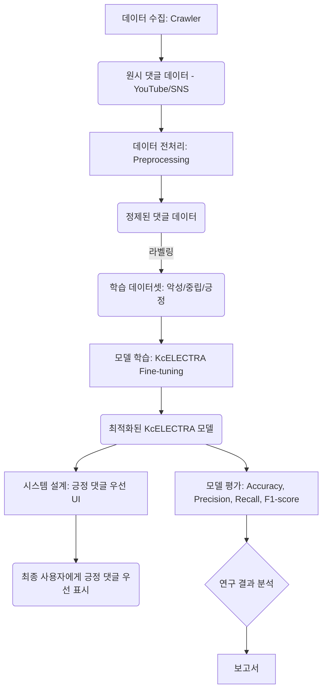

# KcELECTRA를 활용한 댓글 감정 분석 연구

이 프로젝트는 한국어에 최적화된 최신 Transformer 모델인 KcELECTRA를 활용하여 YouTube 및 기타 소셜 미디어 플랫폼의 댓글을 **악성(Negative)**, **중립(Neutral)**, **긍정(Positive)** 세 가지 감성 카테고리로 분류하는 딥러닝 연구입니다. 본 연구는 단순히 댓글 감정을 분석하는 것을 넘어, 분석된 감성 정보를 기반으로 긍정적인 댓글을 사용자에게 우선적으로 표시하는 시스템을 제안하여, 온라인 커뮤니케이션 환경을 더욱 건강하고 긍정적으로 변화시키는 데 기여하고자 합니다.

## 연구 목적

이 연구의 주요 목적은 한국어 데이터셋을 기반으로 KcELECTRA 모델을 Fine-Tuning하여 악성 댓글과 긍정적인 댓글을 분류하고, 이를 통해 사용자에게 긍정적인 댓글을 우선적으로 제공하는 시스템을 제시하는 것입니다. 이러한 시스템은 특히 소셜 미디어에서 건강한 상호작용을 장려하고 긍정적인 소통 문화를 확산시키는 데 기여할 수 있습니다. 

## 모델 선택

- **KcELECTRA**: 한국어에 최적화된 ELECTRA 모델로, 텍스트를 이해하고 분류하는 성능이 뛰어나며, 이 연구에서 핵심 모델로 사용되었습니다.
- **KoELECTRA**: 한국어 데이터셋에 대해 사전 훈련된 또 다른 ELECTRA 기반 모델입니다. KcELECTRA와 비교하여 성능 차이를 분석하고 연구의 기반이 됩니다.

## 데이터셋

본 연구에서 활용된 데이터셋은 다음과 같은 특징을 가집니다.

* 데이터 수집: YouTube 댓글 및 다양한 소셜 미디어 플랫폼에서 직접 크롤링한 데이터를 포함합니다.

* 데이터 분류: 수집된 각 댓글은 **악성(Negative)**, **중립(Neutral)**, **긍정(Positive)**의 세 가지 감정 카테고리로 수작업 또는 준자동 방식으로 분류되었습니다.

* 전처리: KcELETRA 모델의 GitHub를 참고하였으며, 감정 분석의 정확도를 높이기 위해 불필요한 문자 제거, 토큰화 등 세밀한 전처리 과정을 거쳤습니다. 

## 시스템 아키텍처



## 프로젝트 실행 방법
1. Conda 가상환경 생성
```bash
conda create -n project
```
2. 의존성 설치 
```bash
pip install -r requirements.txt
```
3. 데이터 준비 및 데이터전처리 
```bash
python crawler/youtube_crawling.py
python preprocessing/regx_pre.py
```
4. 모델 학습
```bash
python train.py
```

## 모델 학습 및 평가

1. **학습 과정**:
   - KcELECTRA 모델을 악성, 중립, 긍정적인 세 가지 카테고리로 분류할 수 있도록 fine-tuning을 진행하였습니다.
   - 학습은 다양한 하이퍼파라미터를 최적화하여 이루어졌습니다.

2. **평가 지표**:
   - **정확도 (Accuracy)**: 모델이 얼마나 정확하게 각 카테고리를 분류하는지 평가합니다.
   - **정밀도 (Precision)**: 각 카테고리의 예측이 실제로 얼마나 정확한지를 나타냅니다.
   - **재현율 (Recall)**: 실제로 각 카테고리에 속하는 데이터가 얼마나 잘 분류되는지 평가합니다.
   - **F1-score**: 정밀도와 재현율의 조화 평균으로, 모델의 전반적인 성능을 평가합니다.
   - 

## 시스템 설계(UI)

연구에서는 긍정적인 댓글을 우선적으로 표시하는 시스템을 제안합니다. 이 시스템은 KcELECTRA 모델을 사용하여 댓글을 자동으로 분류하고, 긍정적인 댓글을 더 높은 우선순위로 표시하여 사용자에게 제공하게 됩니다. 이러한 시스템은 커뮤니티의 건전한 소통을 유도하는 데 기여할 수 있습니다.

## 참고 문헌

본 프로젝트의 관련 연구 내용은 **KcELECTRA 모델을 활용한 악성 댓글 탐지 및 선한 댓글 우선 정렬** 에서 확인하실 수 있습니다.


